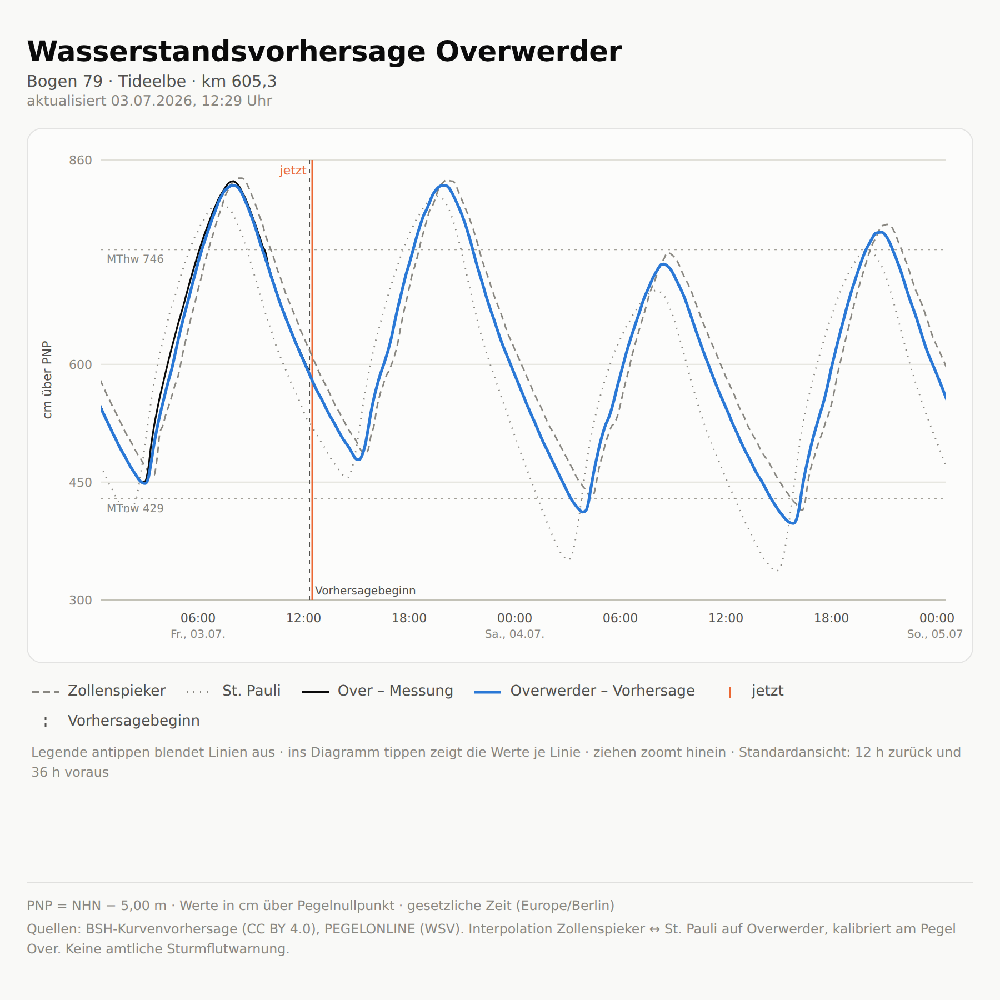

# Wasserstandsvorhersage Overwerder

Vorhersage des Elbe-Wasserstands für **Overwerder** (Wochenendhaus­siedlung
Overwerder, Tideelbe bei Elbe-km ≈ 605,3) aus den **BSH-Wasserstandsvorhersagen**
der Pegel **Zollenspieker** (km 598,3) und **Hamburg St. Pauli / Fischmarkt**
(km 623,1) — kalibriert an Beobachtungen des Messpegels **Over** (PEGELONLINE),
der direkt gegenüber liegt.

Plan und Methodik: [PLAN_MWP.md](PLAN_MWP.md)

**Web-App:** <https://aaronspring.github.io/wasserstandvorhersage_overwerder>



## Web-App (React-Frontend)

Eine schlanke Single-Page-App (`web/`) zeigt die letzten 36 h und die Vorhersage:
Overwerder (hervorgehoben), Messpegel Over, sowie Zollenspieker und St. Pauli
(grau, unterschiedlicher Linienstil), dazu senkrechte Marker (jetzt,
Vorhersagebeginn) und die Tide-Kennwerte MThw/MTnw als waagerechte Linien.

Da GitHub Pages statisch ist, gibt es **kein Live-Backend**. Die Datendatei
`web/public/data.json` wird **nicht eingecheckt**, sondern nur erzeugt: In der CI
(`.github/workflows/deploy.yml`) läuft **alle 6 h** `export_web.py` mit echten
BSH-/PEGELONLINE-Daten, baut das Frontend und deployt nach Pages. Lokal erzeugt
`--demo` synthetische Daten ganz ohne Netz.

```bash
# data.json einmal erzeugen (fuer lokalen Dev, kein Netz):
uv run python export_web.py --demo --out web/public
# ... oder mit echten Daten (braucht Netz):
uv run python export_web.py --out web/public

cd web && npm install && npm run dev   # Dev-Server
npm run build                          # Typecheck + Produktions-Build nach web/dist/
```

Einmalige Einrichtung im Repo: **Settings → Pages → Source = „GitHub Actions"**.
Der `base`-Pfad im Frontend (`web/vite.config.ts`) ist der Repo-Name
`/wasserstandvorhersage_overwerder/`.

## Schnellstart (CLI)

Das Projekt nutzt [uv](https://docs.astral.sh/uv/) für Abhängigkeiten und
Umgebung (`pyproject.toml` + `uv.lock`).

```bash
uv sync                       # Abhängigkeiten installieren (+ .venv anlegen)

# Parameter (Tide-Laufzeit, Gewichte, Offset) an Pegel Over kalibrieren:
uv run python calibrate.py --days 30 --out params.json

# Vorhersage erzeugen (CSV + Plot in out/):
uv run python forecast.py --params params.json --out out/ --bias-correct
```

Ohne `uv` funktioniert auch `pip install -e .` und dann `python forecast.py`.
Ohne `params.json` rechnet `forecast.py` mit entfernungsgewichteten Defaults.
Falls sich die BSH-API-Struktur ändert: `uv run python forecast.py --explore`.

## Tests & Lint

```bash
uv run pytest                 # Tests (kein Netz nötig)
uv run ruff check .           # Lint
uv run ruff format .          # Formatierung
```

## Datenquellen

- [BSH Wasserstandsvorhersage](https://wasserstand.bsh.de) /
  [OGC-API](https://gdi.bsh.de/ldproxy/rest/services/WaterLevelForecast) (CC BY 4.0)
- [PEGELONLINE](https://www.pegelonline.wsv.de) (WSV, Beobachtungen der letzten 31 Tage)
