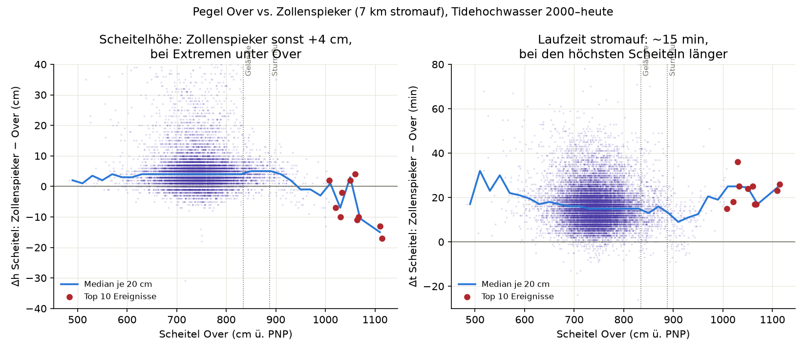
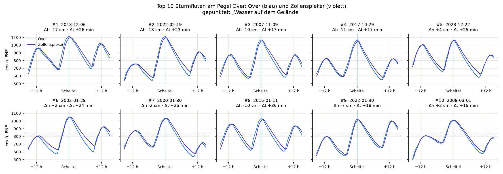

# Pegel Over vs. Zollenspieker bei Sturmfluten (2000–2026)

*Wie verhält sich der Stützpegel **Zollenspieker** (Elbe-km 598,3, 7 km stromauf)
zum Zielpegel **Over** (km 605,3) — und ändert sich das Verhältnis bei
Sturmfluten?*

## Inhaltsverzeichnis

- [Ergebnis](#ergebnis)
- [Die zehn höchsten Ereignisse](#die-zehn-höchsten-ereignisse)
- [Was das fürs Vorhersagemodell heißt](#was-das-fürs-vorhersagemodell-heißt)
- [Hindcast: extrapoliert das Modell in den Sturmflutbereich?](#hindcast-extrapoliert-das-modell-in-den-sturmflutbereich)
- [Datengrundlage & Methodik](#datengrundlage--methodik)
- [Vorbehalte](#vorbehalte)

Beide Pegel liegen im Langzeitarchiv (minütlich seit 2000), Over und
Zollenspieker sind damit die einzigen zwei Stationen, für die sich das Verhalten
*gemessen* über 26 Jahre vergleichen lässt. Einheiten: cm über PNP
(PNP = NHN − 5,00 m), Zeiten in gesetzlicher Zeit (MEZ/MESZ).

> **Warum kein Vorhersage-Vergleich?** Für die historischen Sturmfluten gibt es
> keine archivierten BSH-Vorhersagen: die BSH-API
> (`.../WaterLevelForecast/collections/waterlevelforecastdata`) liefert pro Pegel
> genau ein Feature mit dem **aktuellen** Lauf — kein `datetime`-Filter, kein
> Archiv. Ein echter Soll-Ist-Vergleich ist deshalb nur *vorwärts* möglich (jede
> stündliche `data.json` wegschreiben und später verifizieren). Diese Auswertung
> vergleicht daher zwei **Messreihen** miteinander.

## Ergebnis



18 659 gepaarte Tidehochwasser (2000-01-01 .. 2026-07-02), Mediane:

| Kollektiv                    |    n | Δh = Zollenspieker − Over | Δt = Scheitel später |
|------------------------------|-----:|--------------------------:|---------------------:|
| Normaltiden (< 834 cm)       | 17 986 |                  +4,0 cm |             +15 min |
| Wasser auf Gelände (≥ 834 cm) |   673 |                  +4,0 cm |             +14 min |
| Sturmflut BSH (≥ 888 cm)     |   192 |                  +3,0 cm |             +12 min |

Zwei Befunde:

1. **Der Höhenvorsprung von Zollenspieker kippt bei den Extremen.** Über den
   ganzen Normalbereich liegt der stromauf gelegene Pegel bemerkenswert stabil
   **+4 cm** über Over (Oberwassergefälle). Ab etwa 950 cm ü. PNP dreht das
   Vorzeichen: bei den höchsten Scheiteln liegt Zollenspieker **unter** Over
   (Xaver 2013: −17 cm). Der Windstau drückt von See her — er wirkt stromab
   stärker und läuft flussaufwärts aus. In der Regression:

   ```
   alle Thw    : Zollen = 1,002·Over + 4    (R² = 0,980, n = 18 659)
   nur Sturmflut: Zollen = 0,919·Over + 78  (R² = 0,979, n = 192)
   ```

   Die Steigung fällt im Sturmflutbereich um rund 8 %.

2. **Die Laufzeit ist erstaunlich konstant.** Der Scheitel erreicht
   Zollenspieker im Median 15 min nach Over — über den gesamten Höhenbereich.
   Erst bei den größten Fluten steigt Δt wieder auf 20–25 min (n klein), im
   Bereich knapp über der Sturmflutschwelle ist es mit ~10 min am kürzesten.
   Die Streuung der Einzelwerte (±20 min) ist deutlich größer als das Signal.

## Die zehn höchsten Ereignisse



Dieselben zehn Ereignisse wie in [`TOP_10_STURMFLUTEN.md`](TOP_10_STURMFLUTEN.md):

| #  | Scheitel Over (Berlin) | Over | Zollenspieker |    Δh |     Δt |
|----|------------------------|-----:|--------------:|------:|-------:|
| 1  | 2013-12-06 06:31       | 1114 |          1097 |  −17 | +26 min |
| 2  | 2022-02-19 05:41       | 1110 |          1097 |  −13 | +23 min |
| 3  | 2007-11-09 15:51       | 1067 |          1057 |  −10 | +17 min |
| 4  | 2017-10-29 09:38       | 1064 |          1053 |  −11 | +17 min |
| 5  | 2023-12-22 11:05       | 1060 |          1064 |   +4 | +25 min |
| 6  | 2002-01-29 04:01       | 1050 |          1052 |   +2 | +24 min |
| 7  | 2000-01-30 09:54       | 1033 |          1031 |   −2 | +25 min |
| 8  | 2015-01-11 07:25       | 1030 |          1020 |  −10 | +36 min |
| 9  | 2022-01-30 00:49       | 1021 |          1014 |   −7 | +18 min |
| 10 | 2008-03-01 19:50       | 1008 |          1010 |   +2 | +15 min |

Die Kurvenbilder zeigen das Muster deutlich: **am Scheitel** liegen beide Pegel
fast aufeinander (die vier höchsten mit Zollenspieker leicht darunter), **am
Tideniedrigwasser** dagegen weit auseinander — Zollenspieker fällt im Median
**35 cm** weniger tief (Tnw-Median 444 gegen 411 cm ü. PNP; bei den
Top-10-Ereignissen 2–77 cm). Der Stützpegel bildet also vor allem den
*Hochwasserscheitel* gut ab, nicht die Tidekurve als Ganzes.

## Was das fürs Vorhersagemodell heißt

`model.interpolate` gewichtet Zollenspieker mit ≈ 0,72 und St. Pauli mit ≈ 0,28
(entfernungsgewichtet). Aus dem Vergleich folgt:

- Eine auf Normaltiden kalibrierte **lineare** Beziehung überschätzt den
  Zollenspieker-Anteil bei extremen Fluten leicht (Steigung 1,00 statt 0,92).
  Da St. Pauli bei Sturmfluten überproportional hoch aufläuft, kompensiert der
  Downstream-Term das teilweise — quantifizieren lässt sich das erst mit einem
  St.-Pauli-Archiv (nicht vorhanden, HPA-Pegel).
- Die Laufzeitkonstante `tau` (St. Pauli → Zollenspieker) bleibt auch bei
  Sturmfluten plausibel: der gemessene Teil Over → Zollenspieker (15 min auf
  7 km) ändert sich mit der Scheitelhöhe kaum.
- Die Kalibrierung über die letzten 30 Tage (`calibrate.py`) trifft praktisch
  nie einen Sturmflutfall. Der Sturmflut-Bias ist damit unbeobachtet; die
  Nowcast-Korrektur (`recent_bias_cm`, `NOWCAST_BLEND_MINUTES`) fängt ihn nur
  kurzfristig ab. Siehe [`CAVEAT.md`](CAVEAT.md).

## Hindcast: extrapoliert das Modell in den Sturmflutbereich?

Gegenprobe mit **gemessenen** Stützpegeln — Zollenspieker und, weil St. Pauli
kein Langzeitarchiv hat, dem WSV-Pegel **Cranz** (km 634,4). Kalibriert wird auf
den 31 Tagen **vor** dem Ereignis (endend 24 h vor dem Scheitel), angewendet auf
das Ereignisfenster. Das isoliert den Interpolationsfehler; der BSH-Fehler kommt
im Betrieb obendrauf. 9 der 10 Top-Ereignisse (2000 fehlt, Cranz-Archiv beginnt
später):

| Variante | Median \|Scheitelfehler\| | Median RMSE (±15 h) |
|---|---:|---:|
| statische Parameter | 4,0 cm | 11,2 cm |
| 30-Tage-Rekalibrierung | **2,6 cm** | 8,9 cm |
| Orakel (auf dem Ereignis selbst gefittet) | 1,6 cm | 6,6 cm |

Das Modell wird auf Tiden ≤ ~850 cm kalibriert und trifft Scheitel von
1008–1114 cm auf wenige cm — die Extrapolation bricht **nicht** zusammen, und
zum Orakel fehlt nur ~1 cm.

**Aber der freie Fit kann entarten.** Vor Xaver 2013 und der Januarflut 2002
lieferte die 30-Tage-Kalibrierung `tau ≈ 165 min` (statt 55–65), `a_up ≈ 1,1`,
`a_down ≈ 0,03` und einen Offset von −85 bzw. −116 cm: das Modell kollabiert auf
„nur Zollenspieker plus große Konstante". In-sample gehörte das zu den besten
RMSE des Feldes — der Fit merkt es also nicht. Am Sturmflutscheitel lag es dann
+18 bzw. +36 cm daneben.

Deshalb prüft `model.calibrate` die Kandidaten jetzt gegen
`model.is_plausible` (Gewichte in [0, 1], Summe 0,8–1,2, |Offset| ≤ 50 cm) und
nimmt den besten **plausiblen** Fit; findet sich keiner, wird eingeschränkt
kalibriert (Gewichte fest auf den Entfernungsanteilen, nur `tau` und Offset aus
den Daten, `metrics["restricted"]`). Wirkung im selben Hindcast:

| Ereignis | Scheitelfehler vorher → nachher | RMSE vorher → nachher |
|---|---|---|
| 2013-12-06 (Xaver) | +18,4 → **+4,7 cm** | 20,8 → 11,3 cm |
| 2002-01-29 | +36,1 → **+4,7 cm** | 35,6 → 12,0 cm |

Die übrigen sieben Ereignisse bleiben unverändert, der maximale Scheitelfehler
sinkt von 36,1 auf 5,7 cm. In-sample kostet die Schranke fast nichts (RMSE der
Kalibrierung 7,4 → 7,6 bzw. 8,2 → 8,7 cm).

## Datengrundlage & Methodik

- **Quelle:** Hugging-Face-Dataset
  [`aaronspring/elbe-pegel-over-zollenspieker-minutely-since-2000`](https://huggingface.co/datasets/aaronspring/elbe-pegel-over-zollenspieker-minutely-since-2000)
  (PEGELONLINE-Langzeitarchiv der WSV, minütliche Rohdaten).
- **Filter/Glättung:** Plausibilitätsfenster `PLAUSIBLE_CM_PNP` (50–1300 cm),
  rollierender 11-Minuten-Median gegen Ein-Minuten-Spikes (`sturmflut.tidal_highs`).
- **Paarung:** Tidehochwasser beider Pegel getrennt erkannt, dann je Over-Thw
  das zeitlich nächste Zollenspieker-Thw innerhalb **±3 h** zugeordnet.
- **Schwellen:** amtliche St.-Pauli-Marken, über `sturmflut.align_to_stpauli`
  auf Over übersetzt (Gelände ≥ 834 cm, Sturmflut ≥ 888 cm ü. PNP).
- **Top-10-Ereignisse:** höchste Over-Scheitel, greedy entzerrt (36-h-Fenster) —
  reproduziert exakt die Liste aus [`TOP_10_STURMFLUTEN.md`](TOP_10_STURMFLUTEN.md).

### Reproduktion

```bash
uv sync --extra hf
uv run python analyse_over_zollenspieker.py          # -> docs/over_zollenspieker_*.png
uv run python analyse_over_zollenspieker.py --no-figures   # nur Kennzahlen
```

## Vorbehalte

- **Ungeprüfte Rohdaten** (wie im ganzen Archiv); einzelne Δh/Δt-Werte können
  sich mit geprüften Daten um wenige cm bzw. Minuten verschieben.
- **Kleine Stichprobe oben:** oberhalb 950 cm ü. PNP liegen nur 41 Tiden, über
  1000 cm nur 17. Die Vorzeichenumkehr von Δh ist konsistent, aber statistisch
  dünn.
- **Δt aus Scheitelzeiten** ist bei flachen, breiten Sturmflutscheiteln
  ungenauer als bei spitzen Normaltiden.
- Kein Aussagewert über die **Vorhersagegüte** — beide Reihen sind Messungen.
