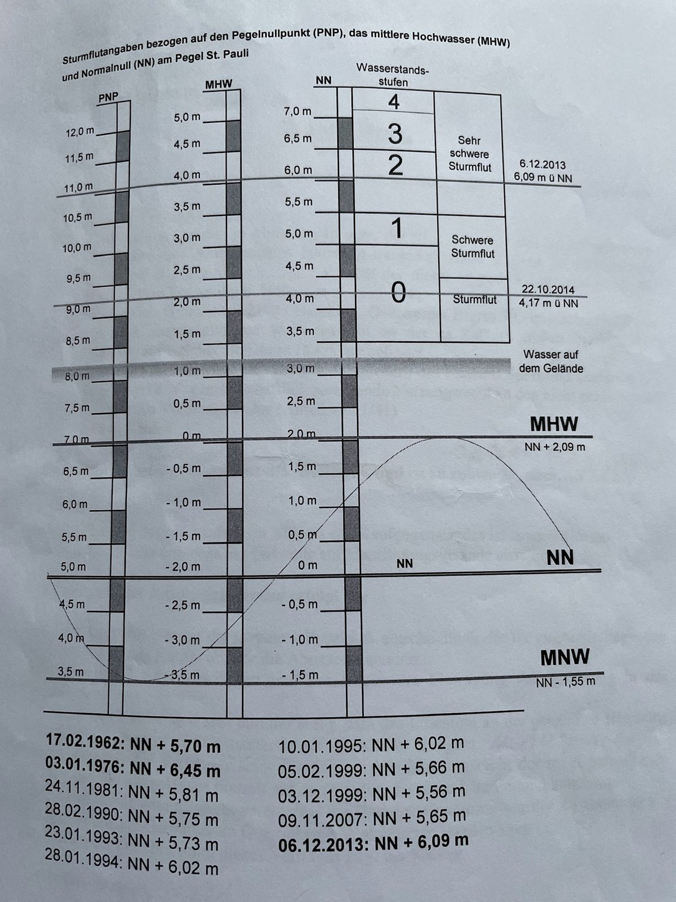
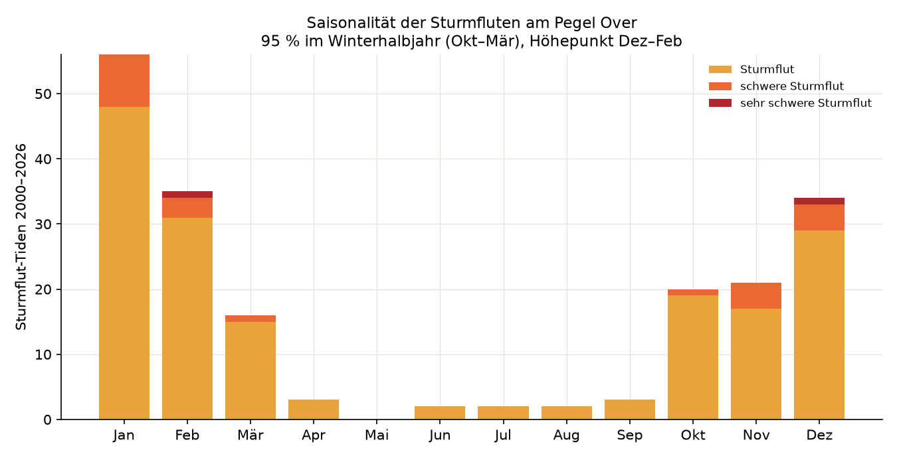
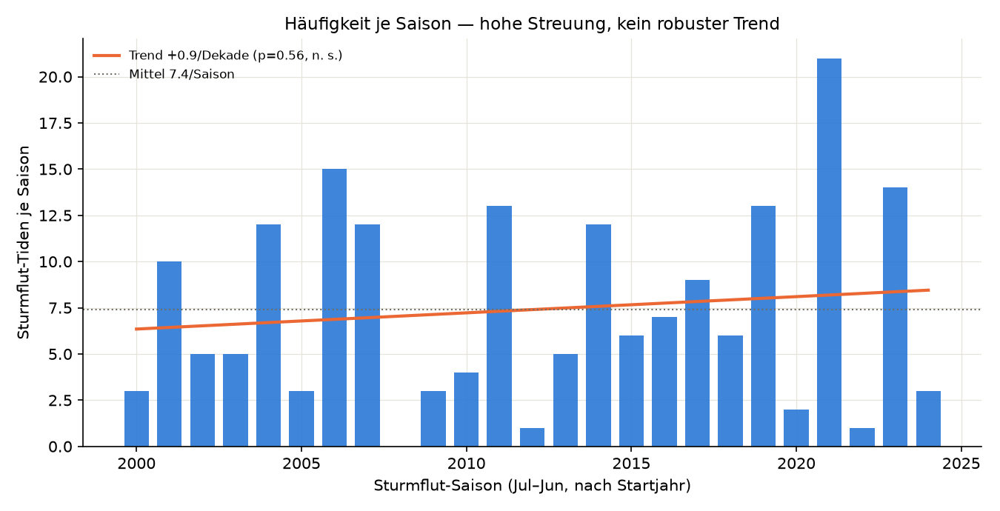
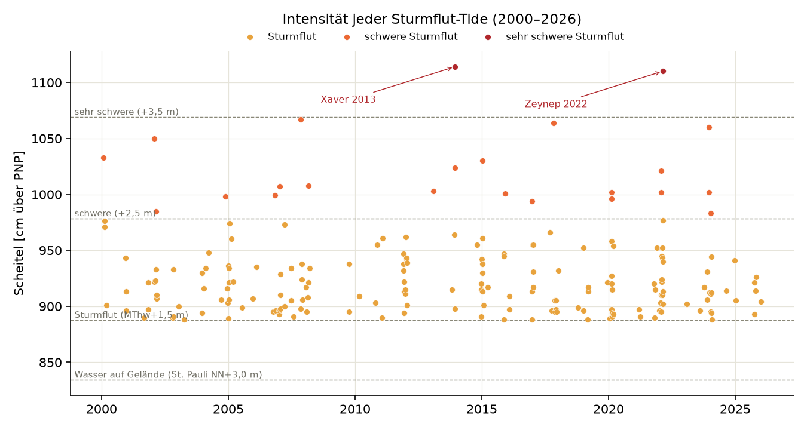
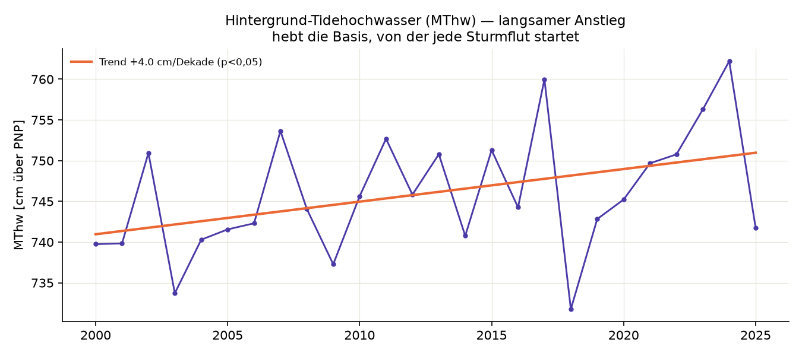
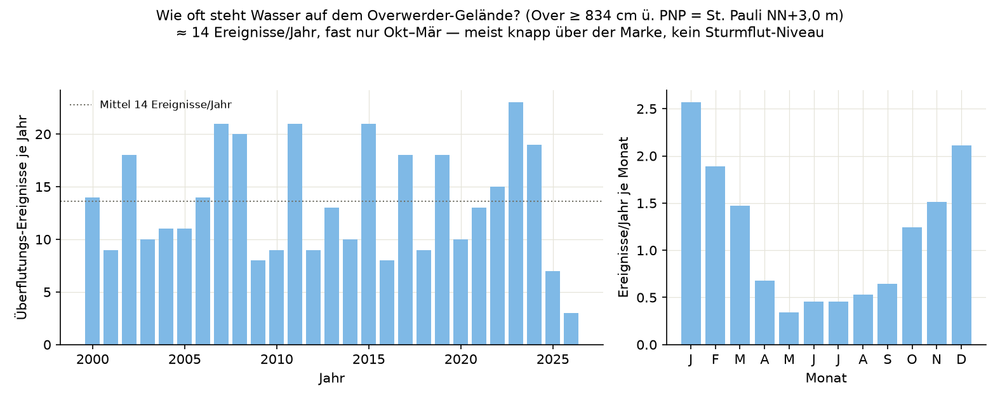

# Sturmfluten & Gelände-Überflutung am Pegel Over — EDA (2000–2026)

Explorative Auswertung aller **Tidehochwasser** am Pegel **Over** (Tideelbe,
Elbe-km 605,3, direkt gegenüber Overwerder) aus dem Langzeitarchiv. Sie
beantwortet vier Fragen:

1. **Saisonalität** — In welchem Monat sind Sturmfluten am wahrscheinlichsten?
2. **Häufigkeit** — Wie viele Sturmfluten pro Saison, welche Klassen?
3. **Trend** — Werden Sturmfluten über die Jahre **häufiger** oder **stärker**?
4. **Gelände** — Wie oft steht **Wasser auf dem Overwerder-Gelände**?

Reproduzierbar mit `analyse_sturmfluten.py` (Kennzahlen + Figuren); die Logik
steht netzfrei/testbar in `wasserstand_overwerder/sturmflut.py`
(`tests/test_sturmflut.py`).

## Kurzantwort

- **Saisonalität:** Sturmfluten sind ein reines **Winterphänomen**. **94 %**
  aller Sturmflut-Tiden fallen in **Okt–Mär**, Höhepunkt **Dez–Feb**; zwischen
  Mai und September praktisch keine.
- **Häufigkeit:** im Mittel **7,4 Sturmflut-Tiden pro Saison** (Jul–Jun), mit
  enormer Streuung — von **0** (2008/09) bis **21** (2021/22).
- **Stärker/häufiger über die Zeit?** **Kein statistisch belastbarer Trend** —
  weder in der Häufigkeit (+0,9/Dekade, p = 0,56) noch in der Intensität
  (+8 cm/Dekade, p = 0,64). Einziges signifikantes Langzeitsignal: das mittlere
  Tidehochwasser (**MThw**) steigt um **≈ 4 cm/Dekade** (p ≈ 0,03) — die *Basis*
  steigt, die *Sturmintensität* nachweisbar nicht.
- **Gelände:** Wasser erreicht das Overwerder-Gelände (St. Pauli NN + 3,0 m) im
  Mittel **≈ 14×/Jahr** — aber **fast nur Okt–Mär** (2–3× pro Wintermonat, im
  Sommer nahezu nie) und **meist nur knapp**: der Median liegt nur **28 cm** über
  der Marke, die wenigsten dieser Tiden erreichen Sturmflut-Niveau.

> **26 Jahre sind kurz** für Aussagen über das Sturmklima; alle Trends sind mit
> dieser Einschränkung zu lesen (Vorbehalte unten).

## Definition: Sturmflut, schwere Sturmflut & „Wasser auf dem Gelände"

Grundlage ist die **Sturmfluttafel der Siedlung Overwerder** (unten). **Alle
Bezugshöhen gelten am Pegel Hamburg St. Pauli** — PNP, MHW und NN sind dort
verankert. Es gilt **PNP = NN − 5,00 m** und **MThw (St. Pauli) = NN + 2,09 m**.

Das **BSH** klassifiziert Sturmfluten an der Nordseeküste über den Aufschlag auf
das MThw:

| Stufe | über MThw (St. Pauli) | = m ü. NN | Referenz-Ereignis |
|---|---|---|---|
| **Wasser auf dem Gelände** | +0,9 m | **NN + 3,0 m** | — (Overwerder-Marke) |
| **Sturmflut** | 1,5 – 2,5 m | NN + 3,6 … 4,6 m | 22.10.2014: NN + 4,17 m |
| **schwere Sturmflut** | 2,5 – 3,5 m | NN + 4,6 … 5,6 m | 09.11.2007 (Tilo): NN + 5,65 m |
| **sehr schwere Sturmflut** | > 3,5 m | > NN + 5,6 m | 06.12.2013 (Xaver): NN + 6,09 m |



### Ausrichtung Over ↔ St. Pauli (über Datums-Anker)

Die Tafel bezieht sich auf **St. Pauli**, unsere Messreihe auf **Over** — beide
Pegel unterscheiden sich: bei Normaltide liegt Over **≈ 37 cm über** St. Pauli
(stärkere Tideverstärkung stromauf), bei Sturmflut-Scheiteln nähern sich die
beiden bis auf wenige cm an. Ein fester Offset genügt also nicht.

Deshalb wird der Zusammenhang **linear aus Datums-Ankern** geschätzt: für bekannte
Sturmfluten mit amtlichem St.-Pauli-Scheitel (Tilo 2007, Xaver 2013, Okt. 2014)
wird der gemessene Over-Scheitel desselben Tages gegenübergestellt, ergänzt um das
MThw-Paar (St.-Pauli-MThw ↔ Over-MThw). Ergebnis:

```
Over[cm PNP] ≈ 0,91 · StPauli[cm PNP] + 108      (R² = 0,996, n = 4)
```

Damit werden die St.-Pauli-Definitionsschwellen auf den Pegel Over übersetzt:

| Stufe | St. Pauli | **Over [cm ü. PNP]** |
|---|---|---|
| Wasser auf dem Gelände | NN + 3,0 m | **≈ 834** |
| Sturmflut | NN + 3,59 m | **≈ 888** |
| schwere Sturmflut | NN + 4,59 m | **≈ 979** |
| sehr schwere Sturmflut | NN + 5,59 m | **≈ 1069** |

(Konstanten & Anker in `config.py`: `ST_PAULI_*`, `WASSER_AUF_GELAENDE_NN_M`,
`ST_PAULI_ANKER_NN_M`; Fit in `sturmflut.align_to_stpauli`.)

## 1) Saisonalität



Die 194 Sturmflut-Tiden verteilen sich stark auf den Kernwinter: **Januar** (56),
**Februar** (35) und **Dezember** (34) tragen den Löwenanteil, ergänzt um Nov/Okt
und März. **94 % liegen in Okt–Mär**; alle **schweren/sehr schweren** Sturmfluten
ausnahmslos im Winterhalbjahr. Die wenigen Sommertreffer sind Grenzfälle knapp
über der Schwelle.

## 2) Häufigkeit je Saison



Gezählt werden **Sturmflut-Tiden je Sturmflut-Saison** (Jul–Jun, benannt nach dem
Startjahr) — jede Tide über der Schwelle zählt (ein Sturm kann mehrere erzeugen).

- Mittel **7,4 Tiden/Saison**, Spanne **0 … 21**.
- Rekordsaison **2021/22** (Zeynep/Antonia, Nadia); **2008/09** ohne eine einzige.
- Diese hohe Streuung — nicht ein Trend — prägt das Bild.

**Klassenverteilung 2000–2026 (St.-Pauli-ausgerichtet):** 171 Sturmflut, 21
schwere, **2 sehr schwere**. Die zwei sehr schweren sind die Rekorde **Xaver**
(06.12.2013, 1114 cm ü. PNP Over) und **Zeynep/Antonia** (19.02.2022, 1110 cm) —
deckungsgleich mit den [Top-10-Sturmfluten](TOP_10_STURMFLUTEN.md).

## 3) Trend: häufiger oder stärker?



**Häufigkeit:** +0,9 Tiden/Saison je Dekade, statistisch **nicht signifikant**
(r = 0,12, p = 0,56). **Intensität:** Saison-Höchstscheitel +8 cm/Dekade,
ebenfalls **nicht signifikant** (r = 0,10, p = 0,64). Auffällig nur, dass die
**schweren+ Sturmfluten** in der zweiten Zeithälfte häufiger sind (15 vs. 7) —
ein Hinweis, aber bei so kleinen Zahlen kein Beleg.



**Das einzige belastbare Signal — der Hintergrundpegel steigt.** Das jährliche
MThw steigt um **≈ 4 cm/Dekade** und ist als einziges der geprüften Maße
**signifikant** (r = 0,41, p ≈ 0,03) — konsistent mit Meeresspiegelanstieg und
Tideverstärkung in der Elbe. Bei *fester* Schwelle nimmt die Zahl der
Überschreitungen allein deshalb zu, weil die Basis steigt, nicht weil die Stürme
heftiger werden. Für das reale Überflutungsrisiko in Overwerder zählt genau diese
Summe (höhere Basis + gleiche Sturmintensität = höhere absolute Scheitel).

## 4) Wie oft steht Wasser auf dem Gelände?



Die Marke „Wasser auf dem Gelände" liegt bei St. Pauli **NN + 3,0 m** — nur
**≈ 0,9 m über dem MThw**. Das ist **keine Sturmflut**, sondern eine leicht
erhöhte Tide (Springtide + etwas Wind). Entsprechend häufig wird sie erreicht:

- **≈ 14 Überflutungs-Ereignisse pro Jahr** (679 Tiden in 361 Ereignissen,
  36-h-Cluster), aber mit großer Jahr-zu-Jahr-Streuung (3 … 23).
- **Fast ausschließlich Okt–Mär** (78 % der Ereignisse): rund **2–3 pro
  Wintermonat** (Jan ≈ 2,6, Dez ≈ 2,1, Feb ≈ 1,9), im Sommer nahezu nie.
- **Meist nur knapp**: der Median liegt **nur 28 cm** über der Marke; **485 der
  679 Tiden** bleiben unter Sturmflut-Niveau. Nur ein kleinerer Teil (≈ 5/Jahr)
  erreicht echte Sturmflut-Stärke.

Kurz: Overwerder liegt im Tide-Vorland, „Wasser auf dem Gelände" ist im Winter ein
regelmäßiges, meist mildes Ereignis; die seltenen Sturmfluten sind die Ausnahme.

## Methodik

1. **Laden & Normieren:** Pegel Over aus dem HF-Dataset
   `aaronspring/elbe-pegel-over-zollenspieker-minutely-since-2000`, minütlich,
   cm über PNP, tz-aware UTC. Plausibilitätsfilter `PLAUSIBLE_CM_PNP` (50–1300 cm).
2. **Tidehochwasser (Thw):** 11-min-Median gegen Spikes, dann lokale Maxima mit
   Mindestabstand 600 min (< die ~745 min zwischen zwei Tiden). **18 695 Thw**,
   mittlerer Abstand 12,4 h.
3. **Ausrichtung Over↔St. Pauli** über Datums-Anker + MThw-Paar (s. o.).
4. **Klassifikation** mit den auf Over übersetzten St.-Pauli-Schwellen.
5. **Ereignisse:** Scheitel < 36 h auseinander = ein Überflutungsereignis.
6. **Aggregation & Trends:** Saison = Jul–Jun; lineare Regression (Steigung, r,
   zweiseitiger p-Wert). Nur volle Saisons 2000/01 … 2024/25 in den Trends.

### Reproduktion

```bash
uv sync --extra hf
uv run python analyse_sturmfluten.py            # Kennzahlen + docs/sturmflut_*.png
uv run python analyse_sturmfluten.py --no-figures
uv run python analyse_sturmfluten.py --data pfad/zu/over.parquet   # offline
```

## Vorbehalte

- **Kurzes Fenster (26 Jahre).** Sturmklima-Trends brauchen längere Reihen; die
  Nicht-Signifikanz heißt „im Rauschen nicht nachweisbar", nicht „kein Trend".
- **Ausrichtung aus nur 4 Stützstellen.** Der Over↔St.-Pauli-Fit stützt sich auf
  drei datierte Ereignisse + das MThw-Paar; besonders am unteren Ende (Gelände-
  Marke) hängt er an wenigen Punkten. Absolute Over-Schwellen (834/888/979/1069)
  können sich mit mehr Ankern oder geprüften St.-Pauli-Daten leicht verschieben.
- **„Wasser auf dem Gelände" = St.-Pauli-Definitionslinie**, keine vermessene
  Overwerder-Geländehöhe. Die tatsächliche Überflutungshäufigkeit einer konkreten
  Parzelle hängt von deren realer Höhe ab und kann abweichen.
- **MThw nicht stationär** (es steigt, s. o.); das feste Voll-Zeitraum-MThw ist
  eine pragmatische Wahl.
- **Ungeprüfte Rohdaten**, heuristische Thw-Erkennung. Grenzfälle nahe der
  Schwelle können einzelne Zählungen verschieben; die qualitativen Aussagen
  (Winter-Saisonalität, kein Intensitätstrend, MThw-Anstieg, mildes häufiges
  Gelände-Wasser) sind robust. Modell-Vorbehalt: [`CAVEAT.md`](CAVEAT.md).
